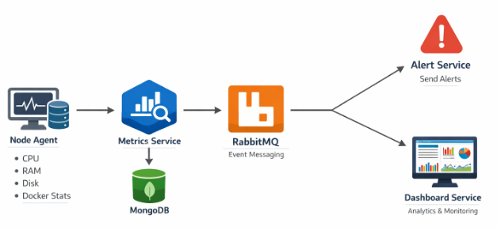
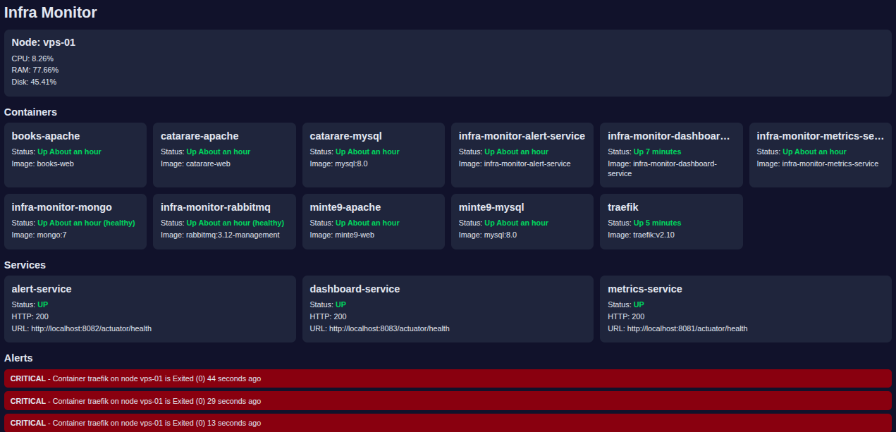

# Infrastructure Monitor (VPS)

The application will monitor:

- VPS CPU
- RAM
- Disk
- Docker containers status
- Microservices health
- Trigger alerts when something goes wrong

## 1. Project structure
v1.0.1

- 1.1 Overview
- 1.2 Multi-module project structure
- 1.3 Gradle multi-module settings
- 1.4 Minimal application.yml files

## 2. Metrics service
v1.0.2

- 2.1 Package structure
- 2.2 Health endpoint config
- 2.3 Request Examples
- 2.4 Test endpoints
- 2.5 Minimal integration test

## 3. MongoDB on metrics-service
v1.0.3

- 3.1 Dependency Injection (DI)
- 3.2 MongoDB dependency
- 3.3 Mondo document
- 3.4 Repository
- 3.5 Metrics injestion service
- 3.6 MongoDB connection
- 3.7 Docker Compose for metric-service + MongoDB
- 3.8 Dockerfile
- 3.9 Test it

## 4. Integration test
v1.0.4

- 4.1 Make the service a bit more useful
- 4.2 Exception handler
- 4.3 Integration test agains MongoDB
- 4.4 Manual test flow

## 5. Event publishing with RabbitMQ
v1.0.5

- 5.1 RabbitMQ dependency
- 5.2 Event contract (common-events) + Beans (note)
- 5.4 Event publisher
- 5.5 Publish after saving to MongoDB
- 5.6 RabbitMQ properties
- 5.7 Update Docker Compose
- 5.8 Quick publisher test
- 5.9 Manual test
- 5.10 Verify the message reached RabbitMQ

## 6. Alert service
v1.0.6

- 6.1 What alert-service does
- 6.2 Package structure
- 6.3 Gradle build settings
- 6.4 Main application class
- 6.5 RabbitMQ config for alert-service
- 6.6 Domain model (alert)
- 6.7 API response DTO
- 6.8 In-memory repository
- 6.9 Alert evaluation service
- 6.10 RabbitMQ listener
- 6.11 REST controller to inspect alerts
- 6.12 application.yml
- 6.13 docker-compose.yml
- 6.14 Dockerfile
- 6.15 Manual test

## 7. Dashboard service
v1.0.7

- 7.1 What dashboard-service will do
- 7.2 Why projections matter
- 7.3 Event contracts
- 7.4 Package structure
- 7.5 Gradle build settings
- 7.6 Main application class
- 7.7 RabbitMQ config
- 7.8 Read model classes
- 7.9 In-memory projection repository
- 7.10 Projection update service
- 7.11 RabbitMQ listeners
- 7.12 REST controller
- 7.13 Service application.yml
- 7.15 Docker Compose
- 7.16 Dockerfile
- 7.17 Manual test flow

## 8. Node agent
v1.0.8

- 8.1 What node-agent will send
- 8.2 Shared metric type enum
- 8.3 Gradle build
- 8.4 Package structure
- 8.5 Main application class
- 8.6 Configuration properties
- 8.7 HTTP client to send metrics
- 8.8 System metrics collector
- 8.9 Docker metrics collector
- 8.10 Service health collector
- 8.11 Scheduler that orchestrates collection
- 8.12 Node-agent application.yml
- 8.13 Manual test flow
- 8.14 Cleanup strategy
- 8.15 Separate service for node-agent
- 8.16 Run it directly (no Gradle)
- 8.17 Logs on VPS

## 9. Vue UI
v1.0.9

- 9.1 Static HTML page
- 9.2 Port clarification
- 9.3 Test the page

## Microservices Architecture

## Screeshots

